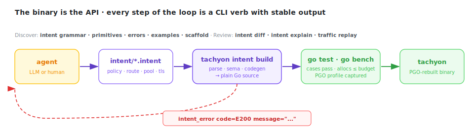

# tachyon

**A reverse proxy written from scratch in Go that keeps up with nginx and Cloudflare's Pingora — and is LLM-driven through a compiler, not YAML.**

*117 ns hot path. Zero allocations per request. Policies compile to Go source, not bytecode. The binary is the API.*

---

### Rust-class throughput, in Go.

On a 16-core GCE box, same workloads, stock configs: tachyon sits a few percent
behind Rust's Pingora on plaintext H1 and ahead of nginx, ties nginx on TLS, and on
large POST bodies — where nginx buffers to disk — it's **9× faster on p99**. Under
burst load Pingora's tail blows out past four seconds; tachyon and nginx both absorb
the same burst in under 15 ms. Go's GC costs under 1.5 % of throughput, with pauses
of 16–29 µs. One person, written from scratch.


Full methodology, every scenario, and reproduction scripts: [BENCHMARK.md](BENCHMARK.md).

### The binary is the API an LLM reads.

Most proxies are configured by YAML an LLM has to guess at. tachyon is configured by `.intent`, a compiled DSL whose entire authoring surface — grammar, primitives, errors, examples — comes out of the binary itself:

```bash
tachyon intent grammar       # the language
tachyon intent primitives    # the verbs
tachyon intent errors        # the stable error catalog (E001..E323)
tachyon intent examples      # working .intent files
tachyon intent scaffold NAME # starter policy
```

An agent writes a `.intent` file. `tachyon intent build` compiles it to ordinary Go, runs the generated tests, runs the generated benchmarks, and either hands back a green bar or a stable error envelope pointing at the offending line:

```
intent_error code=E200 message="policy \"bad\": \"deny\" is not valid in a response block"
```

The agent reads the code, edits, retries. **It is structurally impossible to ship a policy that parses but misbehaves** — every `policy { case ... }` block compiles into a Go test, every `budget { request.allocs <= 1 }` compiles into an allocation assertion that fails the build if the policy gets fatter. Docs can't go stale because there are no docs in the loop: the compiler is the contract.

What the model wrote is what runs. No interpreter, no sidecar, no DSL-to-bytecode layer for either side to reason around.



---

## Quick start — 30 seconds

```bash
go build -o tachyon ./cmd/tachyon
./tachyon -config intent/
```

`intent/config.intent`:

```
intent_version "0.1"

listener { addr ":8080" }

pool api { addrs "127.0.0.1:9000" }

route catchall {
  host "*"
  path "/"
  upstream "api"
}
```

That's it. [`intent/config.intent`](intent/config.intent) is the canonical example with TLS, multi-pool routing, and health checks. [`docs/intent-guide.md`](docs/intent-guide.md) is the policy reference.

---

## LLM-driveable, in detail

The design goal isn't "copy docs into the prompt." It's that Claude Code, Codex, Cursor, or a shell script can discover, author, verify, and ship a configuration change *using only the installed binary* — and never hallucinate, because every structural mistake becomes a compile error with a stable code.


### The loop

```
1. intent grammar | primitives | errors       discover the surface
2. edit intent/*.intent                        author the change
3. intent lint                                 fast structural pass
4. intent build                                codegen → go test → go bench → PGO rebuild
5. intent diff OLD NEW                         behavioral diff for review
6. traffic replay ARTIFACT                     run the candidate against recorded production traffic
7. human approves a plain Go diff              ship
```

Every step is a CLI verb with stable output. No step requires the agent to read prose documentation.

### Why it can't lie

A policy is just a declaration:

```
policy admin_rl {
  priority 150
  match req.path.has_prefix("/api/v1/admin/")
  request {
    rate_limit_local("header:x-api-key", 100, 200)
  }

  case denies_above_burst {
    request.method "GET"
    request.path   "/api/v1/admin/health"
    request.header "x-api-key", "k1"
    expect.status  200
  }

  budget {
    request.allocs <= 1
  }
}
```

Run `tachyon intent build`. The compiler:

- **Parses** — structural errors surface as `E0xx`.
- **Sema-checks** — `E200` (action in wrong phase), `E201` (unreachable terminal), `E202` (contradictory match), `E300+` (unknown pool, duplicate route, TLS key missing its cert, ...).
- **Codegens** Go: a registry, a `TestPolicy_*` for every `case`, a `TestGeneratedBudgets` that fails if allocation exceeds the declared budget, a benchmark.
- **Runs** `go test` and `go test -bench=. -benchmem -cpuprofile current.pprof`.
- **Rebuilds** the binary with that pprof as PGO input — so the next build is faster because of the benchmarks the agent just ran.

If it compiles and tests pass, the policy is structurally sound, allocation-bounded, and pipeline-correct. The human reviews a plain Go diff at the end.

### From ask to policy

> *"Add a 100 rps rate limit keyed on X-API-Key for anything under /api/v1/admin/. Deny with 429."*

The agent scaffolds, writes, and verifies the six-line policy above. If it picks the wrong phase or mis-types an action, the compiler returns `E200` with file and line — no guessing about runtime behavior.

### Traffic replay — the drift check

`tachyon traffic replay` and `tachyon traffic explain` run a candidate config against recorded production traffic before it ships. The agent can quantify behavioral drift — how many requests get different status codes, which policies newly match — without touching a live listener.

### What's deliberately not automated

There is no `tachyon intent evolve` daemon. The binary exposes the surface; the outer loop — Claude Code, a CI job, a scheduled trigger — is your choice. Stable error codes, `-json` output on benches, and machine-parseable envelopes make that wrapper maybe a day of work.

[Full intent guide →](docs/intent-guide.md) · [Examples →](intent/examples/)

---

## Speed, in detail

### The hot path is 117 nanoseconds.

When no policy matches a request, the intent engine contributes **117 ns and 0 allocations** on the proxy's hot path. That number is verified by a generated benchmark that ships in every build.


### Compiled, not interpreted.

```
  intent/*.intent
        │
        ▼   semantic pass
  ┌──────────────┐
  │  sema check  │─── E200: action in wrong phase
  │              │─── E201: unreachable terminal
  │              │─── E202: contradictory match
  └──────┬───────┘─── Class A · B · C assigned
         │
         ▼   codegen
  ┌──────────────┐
  │   generate   │──► registry_gen.go
  │              │──► registry_gen_test.go      ← cases + alloc budgets
  │              │──► registry_gen_bench_test.go
  │              │──► config_gen.go             ← listeners, pools, routes, TLS
  └──────┬───────┘
         │
         ▼   go test ./internal/intent/...
  alloc budgets verified, cases pass
         │
         ▼   go build -pgo=.tachyon/pgo/current.pprof
  binary rebuilt with fresh PGO profile
```

No interpreter, no VM, no reflection, no FFI. Policies run in the same goroutine as the request.

### Go turned out to be fine.

We measured the garbage collector's impact on throughput: **under 1.5 %**, pauses of 16–29 µs. Network RTT is two orders of magnitude larger. The tax for memory safety, a 3-second build, and code your whole team can read is basically nothing.

### How a request moves.


Each request takes one of two exits from the intent engine: pass-through to upstream with header mutations applied, or a short-circuit terminal response.

Policies classify automatically:

| Class | Primitives | io_uring path |
|---|---|:---:|
| **A** — stateless | set_header, remove_header, deny, respond, redirect, route_to, strip/add_prefix | ✓ |
| **B** — local stateful | rate_limit_local, canary | ✓ |
| **C** — external calls | auth_external | stdlib only |

### Process-per-core.

io_uring with a stdlib fallback. kTLS on Linux. `SEND_ZC` for large response bodies. `SPLICE` for kernel-to-kernel copies. `SO_REUSEPORT` fork workers so every core has its own listener, its own heap, its own GC. Custom HPACK and HTTP/2 stack — no stdlib layering. HTTP/3 and QUIC are hand-rolled on top of stdlib UDP — no `quic-go`, same zero-dep stance.


---

## Advanced

### Production-ready

The things that matter when a proxy sits between your users and your revenue — they all work.

**Works out of the box:**
- In-flight requests complete on shutdown. Nothing gets dropped.
- TLS certs rotate without restarting.
- `Expect: 100-continue` answered correctly.
- pprof and Prometheus metrics on a loopback-only debug port.
- Structured logs, keep-alive correct past the 2-minute mark.

**Under load:**
- p2c-EWMA load balancing.
- Passive outlier ejection with half-open probes.
- Active health checks.
- Retry budgets and weighted multi-upstream routing.
- Compiled request policies: rate limiting, header mutation, canary routing, access control.

All of the above optional. All of it zero overhead when disabled.

### Small enough to read


~20,000 lines of Go. When something breaks at 3 AM, you can read the entire request path during the incident. Not "skim the relevant module" — read all of it. The DSL compiler is one directory, the uring runtime is another. No generator, no DI framework, no macro magic.

If you want to port it, fork it, or understand exactly what happens to a byte between accept and write, the whole thing fits in one afternoon.

- [`docs/architecture.md`](docs/architecture.md) — the full walkthrough.
- [`docs/intent-guide.md`](docs/intent-guide.md) — the policy reference.

### Is this for you?

**Pick tachyon if you're doing the normal thing:** terminating HTTP/1.1, HTTP/2, or HTTP/3 in front of your services, with plaintext or a regular TLS cert, on Linux. You'll get a meaningful throughput lift with no new concepts to learn.

**Keep shopping if you need:** a WAF, service discovery, request mirroring, caching, or a full plugin ecosystem. tachyon is focused on being a very fast, very small proxy — not a platform.

### Honest

We don't pretend tachyon replaces every nginx deployment. The table at the top tells you exactly where it wins, ties, and isn't ready. The benchmarks include reproduction scripts so you can check our work.

---

## Learn more

- [BENCHMARK.md](BENCHMARK.md) — full numbers, methodology, reproduction.
- [GUIDE.md](GUIDE.md) — a full intent build, serve, and replay walkthrough.
- [docs/architecture.md](docs/architecture.md) — how it works under the hood.
- [docs/intent-guide.md](docs/intent-guide.md) — request policy reference.
- `./tachyon -h` — every flag, explained.

## Building

Requires Go 1.25+.

```bash
go build ./...       # compile
go test ./...        # unit tests
```

## License

See [LICENSE](LICENSE).
