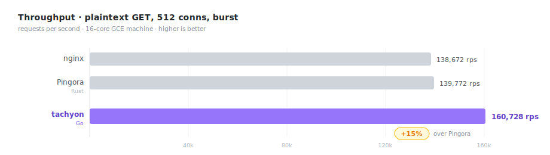
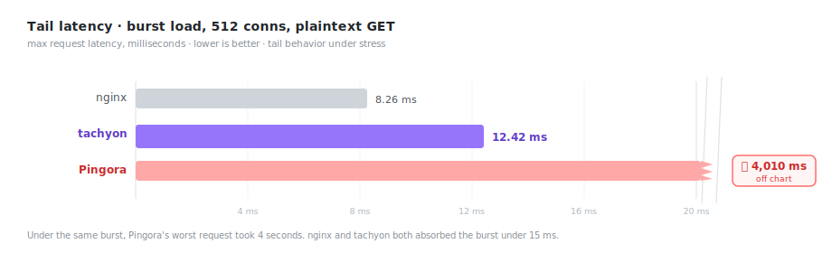
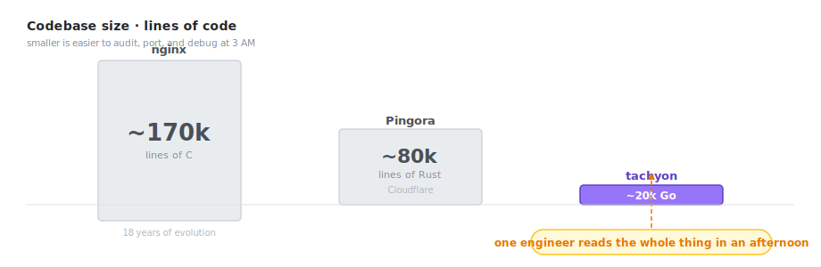
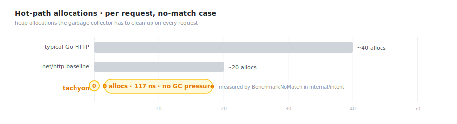
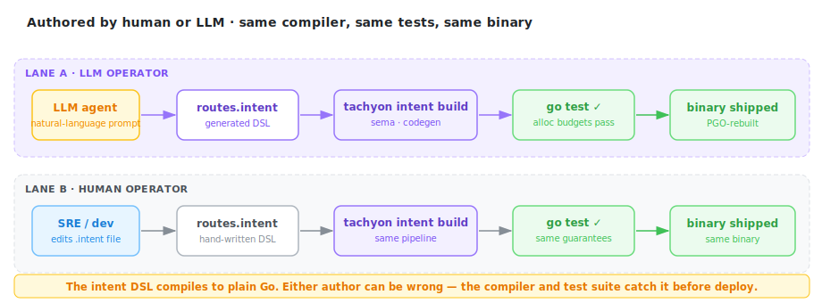
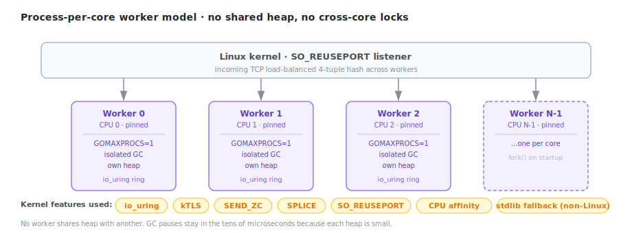
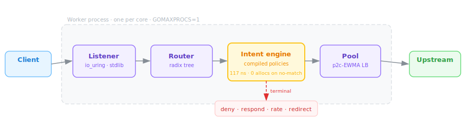

# tachyon

**A reverse proxy that's faster than Nginx and CF Pingora, written in Go, and configurable by an LLM.**

*117 ns hot path. Zero allocations per request. Policies compile to Go source, not bytecode.*

---

## The 15-second pitch







---

## The numbers

Same 16-core GCE machine. Same workloads. Scripts to reproduce everything are in `bench/`.

| Workload | nginx | Pingora (Cloudflare, Rust) | **tachyon (Go)** |
|---|---:|---:|---:|
| Plaintext GET — 512 conns, burst | 138,672 rps | 139,772 rps | **160,728 rps (+15 %)** |
| Plaintext GET — p99 under burst | 13.46 ms | 4,010 ms 💀 | **9.09 ms** |
| TLS 1.3 — p99, 256 conns | 3.13 ms | — | **2.87 ms** |
| TLS 1.3 — p99, 64 KB body | 1.75 ms | — | **1.65 ms** |
| POST 64 KB body — p99 | 16.02 ms 💀 | 1.88 ms | **1.78 ms** |
| Go GC overhead | n/a | n/a | **< 1.5 %** |

**15 % more throughput than Pingora.** Better tail latency than nginx on TLS. On large POST bodies,
nginx's default request-body buffering produces a 16 ms p99; tachyon streams the body and holds 1.78 ms.
(`proxy_request_buffering off` in nginx closes the gap — we ran stock configs.)

Full methodology, raw numbers, and reproduction steps: [BENCHMARK.md](BENCHMARK.md).

---

## Why tachyon is different

### 1. Faster than Rust.

Pingora is the proxy Cloudflare replaced nginx with. On the same 16-core machine, tachyon moves **15 % more requests per second** and holds a 9 ms p99 in the same burst where Pingora's tail blows out to four seconds. Written from scratch in Go, by one person.

### 2. In Go, and "Go is slow" turned out to be wrong.

We measured the garbage collector's impact on throughput: **less than 1.5 %**, with pauses of 16–29 microseconds. Network RTT is two orders of magnitude larger. The tax for memory safety, a 3-second build, and code your whole team can read is basically nothing.

### 3. A compiled intent system.

Write a `.intent` file, run `tachyon intent build`, and you get ordinary checked-in Go — with generated tests and allocation budgets. It all goes through the normal Go toolchain: `go test`, `go vet`, `go build -pgo`. **No interpreter, no VM, no reflection, no FFI.** Policies run in the same goroutine as the request.

**A rate limit in six lines:**

```
policy api_rate_limit {
  priority 100
  match req.path.has_prefix("/api/")
  request {
    rate_limit_local("header:x-api-key", 1000, 2000)
  }
}
```

**Compile, test, rebuild:**

```bash
tachyon intent build intent/*.intent
```

The pipeline:

```
  intent/*.intent
        │
        ▼   semantic pass
  ┌──────────────┐
  │  sema check  │─── E200: action in wrong phase
  │              │─── E201: unreachable terminal
  │              │─── E202: contradictory match
  └──────┬───────┘─── Class A · B · C assigned
         │
         ▼   codegen
  ┌──────────────┐
  │   generate   │──► registry_gen.go
  │              │──► registry_gen_test.go      ← cases + alloc budgets
  │              │──► registry_gen_bench_test.go
  └──────┬───────┘
         │
         ▼   go test ./internal/intent/...
  alloc budgets verified, cases pass
         │
         ▼   go build -pgo=.tachyon/pgo/current.pprof
  binary rebuilt with fresh PGO profile
```

When no policy matches, the cost is **117 ns and 0 allocations.**



### 4. Designed for agent-native workflows.

The intent DSL has a specific property: it compiles to source code a language model can reason about, and a human can review. An AI agent authors a routing change, the compiler catches the structural errors, the generated tests run under `go test`, and a human approves a plain Go diff. No YAML-in-Lua-in-config dance — the output is just Go.



**The binary is the API surface:**

The goal is not "copy docs into the prompt." The goal is that Claude Code, Codex, Cursor, or a shell script can discover everything they need from the installed `tachyon` binary:

```bash
tachyon intent grammar
tachyon intent primitives
tachyon intent examples
tachyon intent errors
tachyon intent agent
tachyon intent scaffold rate_limit > intent/admin_rl.intent
tachyon intent lint intent/admin_rl.intent
tachyon intent build intent/*.intent
tachyon intent diff old/ new/
tachyon intent explain --case sample_headers/sets_powered_by
tachyon traffic replay .tachyon/replays/capture.ndjson.gz
tachyon traffic explain --artifact .tachyon/replays/capture.ndjson.gz --id 42
```

The website and markdown docs are useful, but secondary. The CLI is the stable contract an agent can script against.

**A full CLI workflow for an agent:**

1. Read the grammar, primitive set, and stable error catalog from `tachyon intent grammar`, `tachyon intent primitives`, and `tachyon intent errors`.
2. Start from `tachyon intent scaffold` or inspect `tachyon intent examples`.
3. Write or edit `intent/*.intent`.
4. Run `tachyon intent lint` for fast structural feedback.
5. Run `tachyon intent build` to generate Go, run tests, run benchmarks, capture a PGO profile, and rebuild the binary.
6. Use `tachyon intent diff`, `tachyon intent explain`, `tachyon traffic replay`, and `tachyon traffic explain` to review behavior before shipping.

Compiler failures surface as a stable CLI envelope:

```text
intent_error code=E200 message="policy \"bad\": \"deny\" is not valid in a response block"
```

**Example — request to policy:**

> *"Add a 100 rps rate limit keyed on X-API-Key for anything under /api/v1/admin/. Deny with 429."*

The agent can scaffold or write:

```
policy admin_rl {
  priority 150
  match req.path.has_prefix("/api/v1/admin/")
  request {
    rate_limit_local("header:x-api-key", 100, 200)
  }
}
```

Then the agent runs `tachyon intent build`. If it hallucinated an action or mismatched a phase, the compiler returns a stable error code — `E200` (wrong phase), `E201` (unreachable terminal), `E202` (contradictory match) — with the exact file and line. The agent reads the error, edits, retries. No guessing about runtime behavior: if it compiles and `go test` passes, the policy is structurally sound and within its allocation budget. The human reviews a plain Go diff at the end.

[Full policy guide →](docs/intent-guide.md) · [Examples →](intent/examples/)

### 5. Built for the future.

io_uring with a stdlib fallback. kTLS on Linux. `SEND_ZC` for large response bodies. `SPLICE` for kernel-to-kernel copies. Process-per-core fork model with `SO_REUSEPORT` so every core has its own listener, its own heap, its own GC. Custom HPACK and HTTP/2 stack — no stdlib layering.



### 6. Honest.

We don't pretend tachyon replaces every nginx deployment. The table above tells you exactly where it wins, ties, and isn't ready. The benchmarks include reproduction scripts so you can check our work.

---

## How it works



Each request takes one of two exits from the intent engine: pass-through to upstream with header mutations applied, or a short-circuit terminal response. When no policy matches, the cost is **117 ns and 0 allocations**.

The runtime classifies policies automatically:

| Class | Primitives | io_uring path |
|---|---|:---:|
| **A** — stateless | set_header, remove_header, deny, respond, redirect, route_to, strip/add_prefix | ✓ |
| **B** — local stateful | rate_limit_local, canary | ✓ |
| **C** — external calls | auth_external | stdlib only |

Attach a policy to any route in `config.yaml`:

```yaml
routes:
  - host: "api.example.com"
    path: "/api/"
    upstream: pool-a
    intents:
      - api_rate_limit
```

---

## Production-ready

The things that matter when a proxy sits between your users and your revenue — they all work.

**Works out of the box:**
- In-flight requests complete on shutdown. Nothing gets dropped.
- Config reloads without killing connections.
- TLS certs rotate without restarting.
- `Expect: 100-continue` answered correctly.
- pprof and Prometheus metrics on a loopback-only debug port.
- Structured logs, keep-alive correct past the 2-minute mark.

**Under load:**
- p2c-EWMA load balancing.
- Passive outlier ejection with half-open probes.
- Active health checks.
- Retry budgets and weighted multi-upstream routing.
- Compiled request policies: rate limiting, header mutation, canary routing, access control.

All of the above optional. All of it zero overhead when disabled.

---

## Small enough to read

~20,000 lines of Go. When something breaks at 3 AM, you can read the entire request path during the incident. Not "skim the relevant module" — read all of it. Modules are named for what they do, the DSL compiler is one directory, the uring runtime is another. There is no generator, no DI framework, no macro magic.

If you want to port it, fork it, or understand exactly what happens to a byte between accept and write, the whole thing fits in one afternoon.

- [`docs/architecture.md`](docs/architecture.md) — the full walkthrough.
- [`docs/intent-guide.md`](docs/intent-guide.md) — the policy reference.

---

## Is this for you?

**Pick tachyon if you're doing the normal thing:**
terminating HTTP/1.1 or HTTP/2 in front of your services, with plaintext or a regular TLS cert, on Linux. You'll get a meaningful throughput lift with no new concepts to learn.

**Keep shopping if you need:**
HTTP/3, a WAF, service discovery, request mirroring, caching, or a full plugin ecosystem. tachyon is focused on being a very fast, very small proxy — not a platform.

---

## Try it in 30 seconds

```bash
go build -o tachyon ./cmd/tachyon
./tachyon -config config.yaml
```

`config.yaml`:

```yaml
listen: ":8080"
upstreams:
  api: { addrs: ["127.0.0.1:9000"] }
routes:
  - { host: "*", path: "/", upstream: "api" }
```

That's it. See [`config.sample.yaml`](config.sample.yaml) for TLS, load balancing, health checks, and everything else.

---

## Learn more

- [BENCHMARK.md](BENCHMARK.md) — full numbers, methodology, reproduction.
- [GUIDE.md](GUIDE.md) — a full intent build, serve, and replay walkthrough.
- [docs/architecture.md](docs/architecture.md) — how it works under the hood.
- [docs/intent-guide.md](docs/intent-guide.md) — request policy reference.
- `./tachyon -h` — every flag, explained.

## Building

Requires Go 1.25+.

```bash
go build ./...       # compile
go test ./...        # unit tests
```

## License

See [LICENSE](LICENSE).
